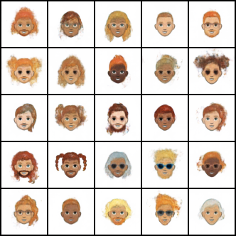
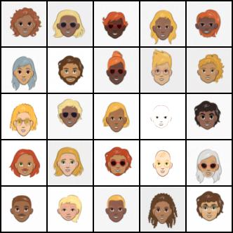

## Overview

This repository is on using **variational autoencoders (VAE)** and **diffusion model (DDPM)** for cartoon image generation. Code is implemented using **Python 3.10** and tested on **Ubuntu** OS. [Cartoon Set](https://google.github.io/cartoonset/) (10k) is used for trainning both the VAE and diffusion models. More implementation details can be found at this [blog post](https://lihanlian.github.io/posts/blog8). 

**VAE Result**

<p align="center">
  
</p>
<p align="center">5x5 VAE sample grid</p>

**DDPM Result**

<p align="center">
  
</p>
<p align="center">5x5 DDPM sample grid</p>

## Run Locally

Clone the project and go to project directory

```bash
  python3 -m venv env && source env/bin/activate 
```
```bash
  pip install -r requirements.txt
```

 - run _train_vae.py_ or _train_ddpm.py_ to train a VAE or DDPM respectively.
 - run _fast_nst_training.py_ to train the feedforward convolutional neural network using fast neural style transfer algorithm.

## To Do
 - Add DDPM code.

## References
 1. [Auto-Encoding Variational Bayes](https://arxiv.org/abs/1312.6114) (VAE Paper)
 2. [Denoising Diffusion Probabilistic Models](https://arxiv.org/abs/2006.11239) (DDPM Paper)
 3. [Diffusion Models | Paper Explanation | Math Explained](https://www.youtube.com/watch?v=HoKDTa5jHvg), [Diffusion Models | PyTorch Implementation](https://www.youtube.com/watch?v=TBCRlnwJtZU&t=874s) (YouTube) and corresponding github repo [Diffusion-Models-pytorch](https://github.com/dome272/Diffusion-Models-pytorch)
 4. [Diffusion Model 原理剖析](https://www.youtube.com/watch?v=67_M2qP5ssY&list=PLJV_el3uVTsNi7PgekEUFsyVllAJXRsP-) by Prof. Hung-yi Lee (李宏毅)